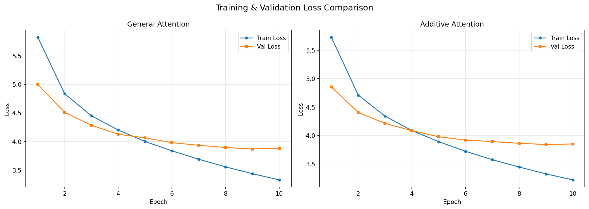

# A3: Make Your Own Machine Translation Language

**NLU Assignment 3** — Seq2Seq Transformer Machine Translation  
**Student**: Dechathon Niamsa-ard [st126235]

---

## Overview

This project implements a **Seq2Seq Transformer** model for **English-to-Thai** machine translation. Two attention mechanisms — **General Attention** (scaled dot-product) and **Additive Attention** (Bahdanau-style) — are compared in terms of translation accuracy, computational efficiency, and attention quality. A Flask web application provides an interactive interface for real-time translation.

---

## Project Structure

```
├── app/                              # Flask web application
│   ├── app.py                       # Flask server + model loading + translation API
│   └── templates/
│       └── index.html               # Translation interface (single-page app)
├── assets/                           # Saved visualizations
│   ├── loss_curves.png              # Training & validation loss plots
│   ├── app-demo.gif                 # Web app demonstration
│   └── scb-mt-en-th-2020_stats_v1.0.png  # Dataset statistics
├── dataset/                          # SCB-MT-EN-TH-2020 parallel corpus
│   └── scb-mt-en-th-2020/
│       ├── generated_reviews_crowd.csv   # Primary subset used (~10k pairs)
│       ├── wikipedia.csv
│       ├── paracrawl.csv
│       └── ...                      # Additional subsets
├── lab_03/                           # Lab reference notebooks
│   ├── 01 - biLSTM.ipynb
│   ├── 02 - CNN.ipynb
│   ├── Appendix - LSTM + Attention from Scratch.ipynb
│   ├── MT + Attention.ipynb
│   └── MT + Transformer.ipynb       # Base reference for this assignment
├── model/                            # Saved model artifacts
│   ├── best_model.pt               # Best model weights (Additive Attention)
│   ├── general_attention.pt         # General Attention checkpoint
│   ├── additive_attention.pt        # Additive Attention checkpoint
│   ├── config.json                  # Model architecture configuration
│   └── vocab.json                   # Source & target vocabularies
├── st126235_assignment_3.ipynb       # Main notebook (Tasks 1–4)
├── pyproject.toml                    # Project config & dependencies
└── README.md                         # This file
```

---

## Quick Start

```bash
# Setup environment
uv venv && uv sync
# Or: pip install torch flask spacy pythainlp datasets matplotlib pandas

# Download spaCy English model
python -m spacy download en_core_web_sm

# Train model (run notebook cells)
jupyter notebook st126235_assignment_3.ipynb

# Run web app
cd app && python app.py
```

Open http://localhost:5000 in your browser.

---

## Task 1: Get Language Pair (2 points)

**Objective**: Find a dataset suitable for translation between your native language and English. Describe the dataset preparation process including text normalization, tokenization, and word segmentation. Provide proper attribution for both the dataset and tools used.

### What I Chose:
- **SCB-MT-EN-TH-2020** dataset (`generated_reviews_crowd` subset)
- Source: [AI Research Institute of Thailand (AIRESEARCH)](https://airesearch.in.th/releases/machine-translation-datasets/)
- 24587 rows total
- Natural, conversational text well-suited for neural translation

### Dataset Preparation:

| Step | Description |
|------|-------------|
| Cleaning | Drop rows with missing values, remove duplicates |
| Filtering | Remove sentences >100 English words or <2 English words |
| Splitting | 80/10/10 train/validation/test ratio (shuffled, fixed seed) |

### Dataset Statistics:

| Split | Size |
|-------|------|
| Training | 19669 |
| Validation | 2459 |
| Test | 2459 |

### Tokenization:

Two distinct tokenization strategies are used because English and Thai have fundamentally different writing systems:

| Language | Tokenizer | Details |
|----------|-----------|---------|
| English | spaCy (`en_core_web_sm`) | Handles punctuation separation, contractions |
| Thai | PyThaiNLP (`newmm` engine) | Dictionary-based maximum matching for word segmentation (Thai has no spaces between words) |

### Vocabulary:

| Token | Index | Purpose |
|-------|-------|---------|
| `<unk>` | 0 | Unknown/out-of-vocabulary words |
| `<pad>` | 1 | Padding shorter sequences to equal length |
| `<sos>` | 2 | Start-of-sequence signal for the decoder |
| `<eos>` | 3 | End-of-sequence signal to stop generation |

- **Minimum frequency**: 2 (tokens appearing only once are filtered out)
- **English vocabulary size**: 6,531 tokens
- **Thai vocabulary size**: 6,136 tokens

---

## Task 2: Experiment with Attention Mechanisms (1 point)

**Objective**: Implement a sequence-to-sequence neural network for the translation task with the following attention mechanisms and their respective equations.

### Model Architecture:

The model follows the **Transformer architecture** from *"Attention Is All You Need"* (Vaswani et al., 2017), consisting of an Encoder and Decoder with interchangeable attention mechanisms.

| Component | Configuration |
|-----------|---------------|
| Embedding Dimension | 256 |
| Encoder Layers | 3 |
| Decoder Layers | 3 |
| Attention Heads | 8 (32 dim per head) |
| Feedforward Dimension | 512 |
| Dropout Rate | 0.3 (training) / 0.1 (inference) |
| Max Sequence Length | 512 |
| Positional Encoding | Learned embeddings |
| Weight Initialization | Xavier (Glorot) uniform |

### 1) General Attention (Scaled Dot-Product)

$$e_i = s^T h_i \in \mathbb{R} \quad \text{where} \quad d_1 = d_2$$

Computes alignment scores using the dot product between query and key vectors, scaled by $\sqrt{d_k}$ to prevent vanishing gradients in the softmax. Computationally efficient — relies purely on matrix multiplication.

### 2) Additive Attention (Bahdanau-Style)

$$e_i = v^T \tanh(W_1 h_i + W_2 s) \in \mathbb{R}$$

Uses a small feedforward network with learned weight matrices $W_1$, $W_2$ and vector $v$. More learnable parameters and theoretically more expressive due to the non-linear `tanh` activation, at the cost of slightly higher computation.

### Training Configuration:

| Setting | Value |
|---------|-------|
| Epochs | 10 |
| Batch Size | 64 |
| Learning Rate | 0.0005 (Adam) |
| Gradient Clipping | 1.0 |
| Loss Function | Cross-Entropy (ignoring `<pad>`) |
| Teacher Forcing | Yes (ground truth target as decoder input) |

Both attention variants are trained with **identical hyperparameters** to ensure a fair, controlled comparison.

---

## Task 3: Evaluation and Verification (2 points)

**Objective**: Compare the performance of attention mechanisms in terms of translation accuracy, computational efficiency, and other relevant metrics. Provide performance plots showing training and validation loss, display attention maps, and analyze the results.

### Performance Comparison:

| Attentions | Training Loss | Training PPL | Validation Loss | Validation PPL |
|:---:|:---:|:---:|:---:|:---:|
| General Attention | 3.330 | 27.936 | 3.870 | 47.929 |
| Additive Attention | 3.221 | 25.060 | 3.842 | 46.642 |

> **Best Model**: Additive Attention (lowest validation loss)

### Training & Validation Loss Curves



### Attention Maps

Attention maps visualize which source (English) tokens the model focuses on when generating each target (Thai) token. Brighter cells indicate higher attention weights.

- A well-trained model shows strong attention between semantically related word pairs (e.g., "beautiful" ↔ "สวย", "country" ↔ "ประเทศ").
- Comparing maps between General and Additive attention reveals differences in alignment sharpness and distribution patterns.

### Analysis:

- **General Attention** — Computationally efficient due to pure matrix multiplication. Produces reasonable translations but may have less focused attention distributions.
- **Additive Attention** — More expressive due to the non-linear feedforward network ($W_1$, $W_2$, $v$). Slightly more parameters but produces better word alignment and translation quality for the English-to-Thai task.

---

## Task 4: Machine Translation - Web Application Development (1 point)

**Objective**: Develop a simple web application that showcases the capabilities of the language model in machine translation. The application should feature an input box for entering sentences, generate and display translations, and provide documentation on how the web application interfaces with the language model.


### Features

- **Flask web app** with clean, minimal UI
- **Text input** — Enter any English sentence
- **Thai translation** — Displays the translated Thai text
- **Token breakdown** — Shows source and target token sequences

### System Architecture

```
┌──────────────────┐       POST /translate       ┌──────────────────┐
│                  │  ─────────────────────────>  │                  │
│   Browser (UI)   │     {"sentence": "..."}      │   Flask Server   │
│   index.html     │                              │    app.py        │
│                  │  <─────────────────────────  │                  │
└──────────────────┘  {"translation": "..."}      └────────┬─────────┘
                                                           │
                                                  ┌────────▼─────────┐
                                                  │  Seq2Seq Model   │
                                                  │  (Transformer)   │
                                                  │                  │
                                                  │  best_model.pt   │
                                                  │  vocab.json      │
                                                  │  config.json     │
                                                  └──────────────────┘
```

### How the Web App Interfaces with the Language Model

#### 1. Model Loading (Server Startup)

When the Flask server starts, it performs a one-time initialization:

1. **Load configuration** — reads `model/config.json` for architecture hyperparameters (`hid_dim=256`, `n_layers=3`, `n_heads=8`, `pf_dim=512`) and which attention type was selected as best.
2. **Load vocabularies** — reads `model/vocab.json` containing `stoi` (string-to-index) and `itos` (index-to-string) mappings for both English and Thai.
3. **Set up tokenizers** — spaCy `en_core_web_sm` for English; PyThaiNLP `newmm` for Thai.
4. **Reconstruct the model** — the full `Seq2SeqTransformer` (Encoder + Decoder) is rebuilt with the exact same architecture as training and weights are loaded from `best_model.pt`.

#### 2. Translation Pipeline

| Step | Component | Description |
|------|-----------|-------------|
| 1 | spaCy tokenizer | Tokenizes English input into word tokens |
| 2 | Vocabulary lookup | Converts tokens to integer indices via `src_vocab` |
| 3 | Add special tokens | Wraps with `<sos>` and `<eos>` indices |
| 4 | Encode | Passes source through Transformer Encoder |
| 5 | Autoregressive decode | Starting from `<sos>`, greedily predicts one token at a time |
| 6 | Stop condition | Halts when `<eos>` is predicted or `max_len=50` reached |
| 7 | Detokenize | Converts indices back to Thai tokens via `trg_vocab`, strips special tokens |

#### 3. API Endpoints

| Endpoint | Method | Description | Request Body | Response |
|----------|--------|-------------|--------------|----------|
| `/` | GET | Serves the main translation interface | — | HTML page |
| `/translate` | POST | Translates English to Thai | `{"sentence": str}` | `{"source": str, "source_tokens": list, "translation": str, "translation_tokens": list}` |

### Running the App

```bash
cd app
python app.py
# Open http://localhost:5000
```

---

## Dataset Source

| Dataset | Description | Source |
|---------|-------------|--------|
| SCB-MT-EN-TH-2020 | Large-scale English-Thai parallel corpus | [AIRESEARCH / VISTEC]([https://github.com/vistec-AI/dataset-releases/releases/tag/scb-mt-en-th-2020_v1.0](https://airesearch.in.th/releases/machine-translation-datasets/)) |

**Citation**:
```bibtex
@inproceedings{scb-mt-en-th-2020,
    title     = {scb-mt-en-th-2020: A Large English-Thai Parallel Corpus},
    author    = {Lowphansirikul, Lalita and Polpanumas, Charin and Rutherford, Attapol T. and Nutanong, Sarana},
    year      = {2020},
    publisher = {VISTEC / AI Research Institute of Thailand}
}
```

---

## Technical Notes

- **Torchtext Compatibility**: The original `torchtext` library is deprecated and incompatible with modern PyTorch. A custom compatibility layer replicates `build_vocab_from_iterator`, `Vocab`, and `get_tokenizer` functions.
- **GPU Support**: Trained on NVIDIA RTX 5060 Ti (Blackwell architecture) requiring PyTorch 2.7+.
- **Thai Word Segmentation**: Thai script does not use spaces between words, so PyThaiNLP's `newmm` (New Maximum Matching) engine is essential for proper tokenization.
- **Self-Contained Web App**: All model classes are replicated inside `app.py` so the web app does not import from the notebook.
- **Model Checkpointing**: Best model saved based on validation loss; both attention variants are saved independently.

---

## References

- Vaswani et al., *"Attention Is All You Need"* (2017) — [arXiv:1706.03762](https://arxiv.org/abs/1706.03762)
- Bahdanau et al., *"Neural Machine Translation by Jointly Learning to Align and Translate"* (2014) — [arXiv:1409.0473](https://arxiv.org/abs/1409.0473)
- Chaudhari et al., *"An Attentive Survey of Attention Models"* — [arXiv:1904.02874](https://arxiv.org/abs/1904.02874)
- SCB-MT-EN-TH-2020 — [GitHub Release](https://github.com/vistec-AI/dataset-releases/releases/tag/scb-mt-en-th-2020_v1.0)
- PyThaiNLP — [GitHub](https://github.com/PyThaiNLP/pythainlp)
- spaCy — [spacy.io](https://spacy.io)

---

## Requirements

- Python 3.13+
- PyTorch 2.7+
- Flask 3.0+
- spaCy 3.8+ (`en_core_web_sm`)
- PyThaiNLP 5.2+
- Pandas 3.0+
- Matplotlib 3.10+
- HuggingFace Datasets
- NumPy

See `pyproject.toml` for full dependencies.

---
